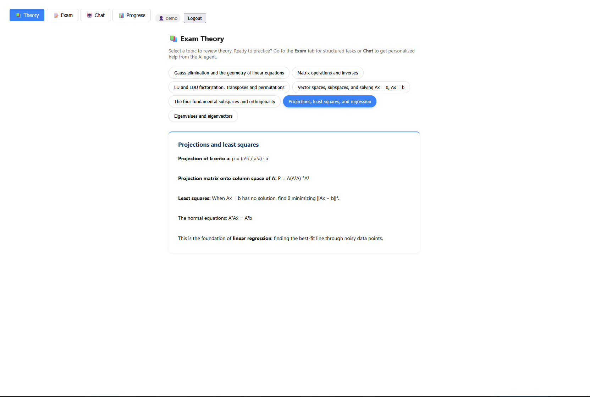
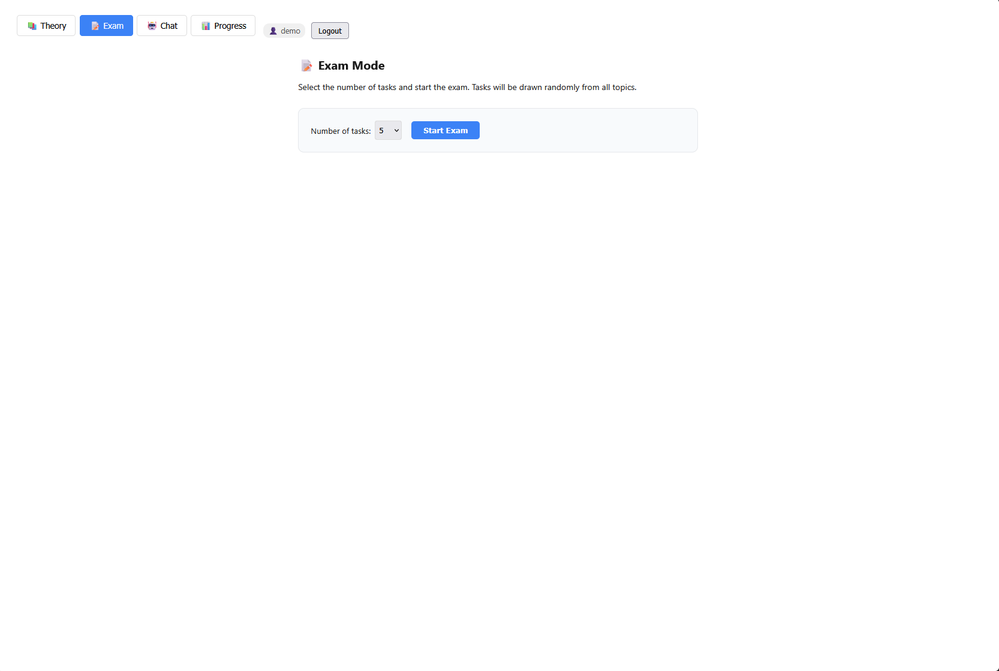
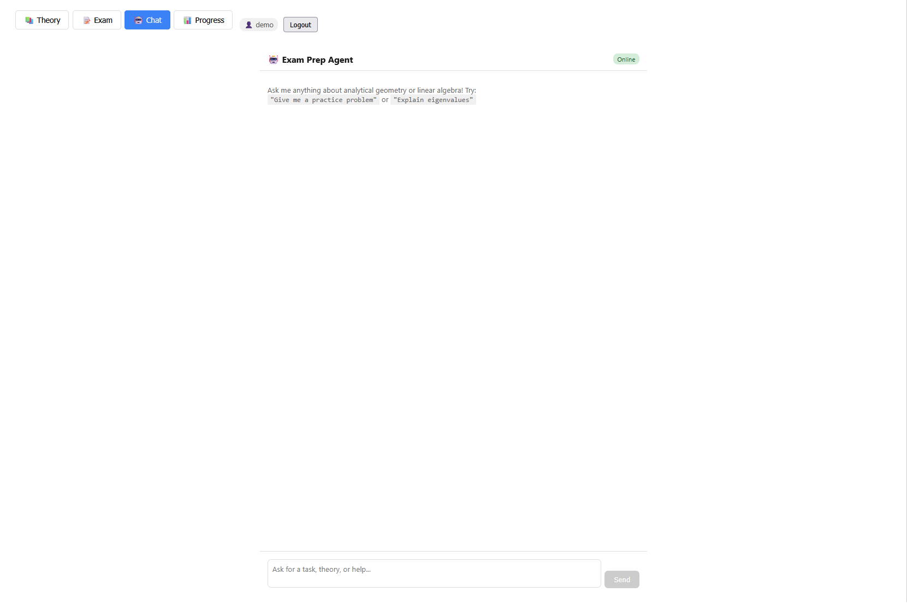

# Exam Prep Bot — Analytical Geometry & Linear Algebra

> An AI-powered exam preparation platform with theory review, interactive practice, mock exams, and a chat-based AI tutor.

## Demo

**Screenshots:**

*Theory review page with topic selection and formatted content.*

*Interactive exam mode with progress tracking and per-task feedback.*

*AI chat tutor for personalized help with any topic.*


## Product Context

| Element | Description |
|---|---|
| **End user** | Student preparing for Analytical Geometry & Linear Algebra exam |
| **Problem** | No convenient way to practice — problems are scattered, no instant feedback, theory needs to be searched separately |
| **Solution** | Web app with organized theory, randomized practice problems, LLM-graded answers, and an AI chat tutor |

## Features

### ✅ Implemented

| Feature | Description |
|---|---|
| **Theory** | Browse 7 exam topics, each with detailed theory pages covering formulas, definitions, and examples |
| **Exam Mode** | Structured mock exam with 3/5/7/10 randomized tasks, instant AI grading, auto-submission to progress tracking |
| **AI Chat** | Conversational AI tutor powered by Qwen Code API — ask questions, get practice problems, receive explanations with LaTeX rendering |
| **Progress** | Per-student statistics: total attempts, accuracy, topics attempted/solved |
| **MCP Tools** | 8 tools: list topics, get task, check answer, get theory, submit answer, get progress, start exam mode, health check |

### 🔜 Planned

| Feature | Description |
|---|---|
| Mobile-friendly responsive layout | UI improvements |
| More topics and problems | Content expansion |

## Usage

1. Open `http://10.93.25.40:42002` in a browser.
2. Enter your name/ID on the welcome screen.
3. Enter the API key to unlock all features.
4. **Theory** — browse topics and review material.
5. **Exam** — start a mock exam, answer tasks, get instant AI feedback.
6. **Chat** — talk to the AI tutor for personalized help.
7. **Progress** — view your practice statistics.

## Deployment

### Prerequisites (Ubuntu 24.04)

- Docker & Docker Compose
- Git
- A Qwen Code API key (1000 free requests/day at [Qwen](https://chat.qwen.ai/))

### Step-by-step

1. **Clone the repository:**

   ```bash
   git clone --recurse-submodules https://github.com/YOUR_USERNAME/se-toolkit-hackathon.git
   cd se-toolkit-hackathon
   ```

2. **Create environment file:**

   ```bash
   cp .env.docker.example .env.docker.secret
   ```

3. **Set required values in `.env.docker.secret`:**

   ```text
   LMS_API_KEY=any-secret-key
   EXAM_API_KEY=any-exam-secret-key
   QWEN_CODE_API_KEY=your-qwen-api-key
   NANOBOT_ACCESS_KEY=your-private-password
   ```

4. **Start all services:**

   ```bash
   docker compose --env-file .env.docker.secret up --build -d
   ```

5. **Open the app:**
   - React UI: `http://localhost:42002`
   - API docs: `http://localhost:42002/docs`

## Repository Structure

```
├── backend/src/exam_prep/       # Exam prep backend (models, routers, seed data)
├── client-web-react/src/        # React web UI (Theory, Exam, Chat, Progress)
├── mcp/mcp-exam-prep/           # MCP server for exam prep tools
├── nanobot/                     # Nanobot config and exam-prep skill
├── docker-compose.yml           # All services definition
└── caddy/Caddyfile              # Reverse proxy config
```
